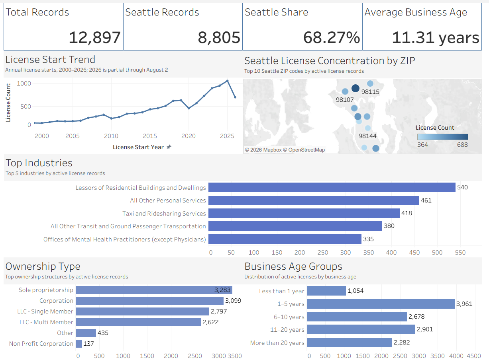

# Seattle Business License Analysis

## Project Background

This project analyzes Seattle active business license data to understand the city's current business landscape, including industry composition, geographic distribution, ownership structure, and business age.

## Project Status

SQL analysis, Excel validation, and the interactive Tableau dashboard are complete. Final insights and documentation are in progress.

## Tools

- MySQL
- Excel
- Tableau Public

## Interactive Tableau Dashboard

[Open the interactive Tableau dashboard](https://public.tableau.com/views/seattle_business_license_dashboard/SeattleBusinessLicenseDashboard?:language=en-US&:sid=&:redirect=auth&:display_count=n&:origin=viz_share_link)

The dashboard is based on a City of Seattle Open Data snapshot downloaded on August 2, 2026. The 2026 license-start total is partial through that date.